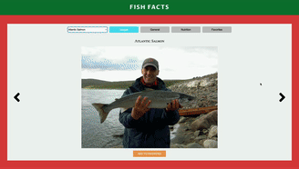

# fish-facts

A dynamic HTML, CSS, and JavaScript web application for people who want to view images and learn about 110+ species of fish.

The main reason why I wanted to build this project was because I wanted to learn more about fish species myself.  And with the public API at https://www.fishwatch.gov/api/species, which holds images and facts of more than 110 different species, I thought this would be a cool and useful project for myself and others who want to learn about a variety of fish species.

## Live Demo

Try the application live at [https://daniel-j-cho.github.io/Fish-Facts/](https://daniel-j-cho.github.io/Fish-Facts/)

## Technologies Used

- HTML5
- CSS3
- JavaScript

## Features

- Users can select a species of fish from a dropdown menu.
- Users can view images of a species by clicking on the “Images” tab.
- Users can view general facts of a species by clicking on the “General” tab.
- Users can view nutritional facts of a species by clicking on the “Nutrition” tab.
- Users can add a species to the favorites page and view the added species by clicking on the “Favorites” tab.

## Stretch Feature
- I would like to add a confirmation modal before users delete a "favorited" species.

## Preview



### System Requirements

- Node.js 16 or higher
- NPM 8.5 or higher

### Getting Started

1. Clone the repository

  ```shell
  git clone https://github.com/Daniel-J-Cho/Fish-Facts.git
  cd fish-facts
  ```

2. Install all dependencies with NPM.

  ```shell
  npm install
  ```

3. View the application by right clicking on "index.html" and opening it with your default browser or server.
